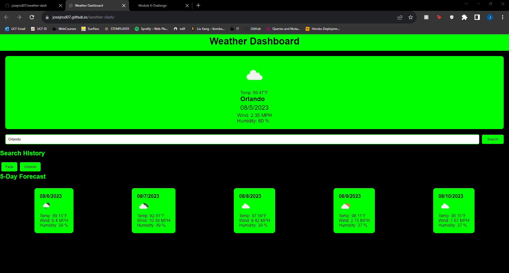

# Weather Dashboard

This is a weather dashboard web application that allows travelers to view the weather outlook for multiple cities, helping them plan their trips accordingly. The application utilizes the OpenWeather API to retrieve weather data for the searched cities and dynamically updates the HTML and CSS to display the current and future weather conditions.

## Table of Contents

- [Usage](#usage)
- [Features](#features)
- [License](#license)
- [Links](#links)

## Usage

- Open the application at the deployment link below.
- Enter the name of the city you want to check the weather for in the search bar.
- Click on the "Search" button to view the weather information for the searched city.
- The current weather conditions will be displayed, including the city name, date, weather icon, temperature, humidity, and wind speed.
- Scroll down to view the 5-day forecast, which shows the date, weather icon, temperature, wind speed, and humidity for the next five days.
- The searched city will be added to the search history, allowing you to click on it later to view the weather information again.

## Features

- Dynamic Weather Data: The application retrieves real-time weather data from the OpenWeather API and displays it on the dashboard for the searched cities.

- Search History: The application stores the search history of cities using localStorage, allowing users to easily access previously searched cities.

- Clean and Responsive UI: The user interface is designed with a clean and responsive layout, making it user-friendly on various devices and screen sizes.

## Screenshot

## License

This project is licensed under the MIT License - see the LICENSE file for details.

## Links

[Repository](https://github.com/josejrod07/weather-dash.git)

[Deployment](https://josejrod07.github.io/weather-dash/)